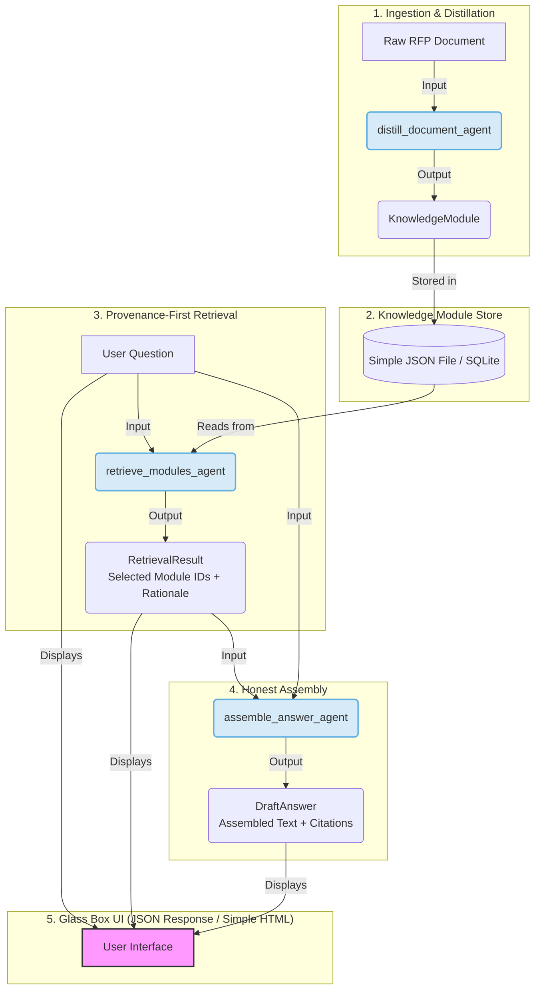

# Architecture Diagram

```mermaid
graph TD;
    subgraph "1. Ingestion & Distillation"
        A[Raw RFP Document] -- "Input" --> B(distill_document_agent);
        B -- "Output" --> C(KnowledgeModule);
    end

    subgraph "2. Knowledge Module Store"
        D[(Simple JSON File / SQLite)];
    end

    subgraph "3. Provenance-First Retrieval"
        E[User Question] -- "Input" --> F(retrieve_modules_agent);
        D -- "Reads from" --> F;
        F -- "Output" --> G(RetrievalResult<br>Selected Module IDs + Rationale);
    end

    subgraph "4. Honest Assembly"
        G -- "Input" --> H(assemble_answer_agent);
        E -- "Input" --> H;
        H -- "Output" --> I(DraftAnswer<br>Assembled Text + Citations);
    end

    subgraph "5. Glass Box UI (JSON Response / Simple HTML)"
        style J fill:#f9f,stroke:#333,stroke-width:2px
        J[User Interface];
    end

    C -- "Stored in" --> D;
    E -- "Displays" --> J;
    G -- "Displays" --> J;
    I -- "Displays" --> J;

    classDef agent fill:#D6EAF8,stroke:#5DADE2,stroke-width:2px;
    class B,F,H agent;
```
